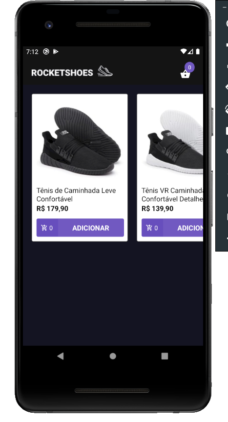
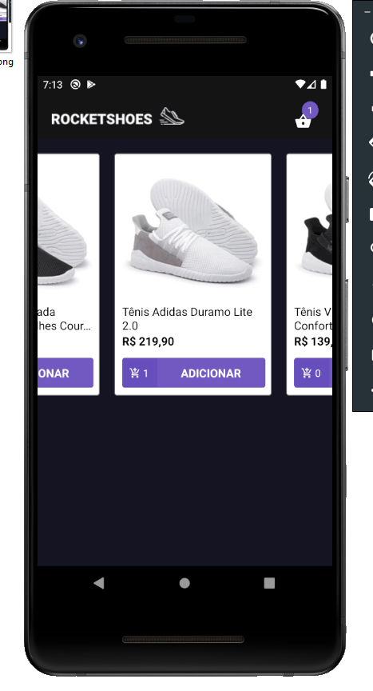
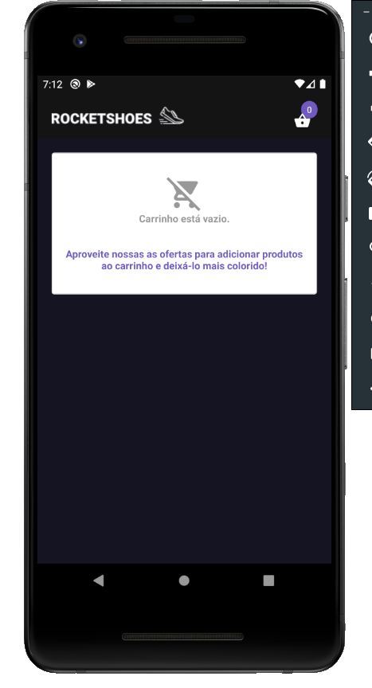
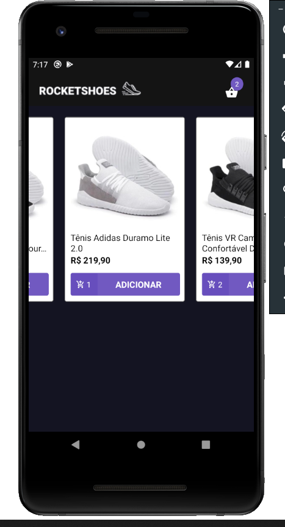

<h1 align="center" >
    
  Bootcamp 9.0 da :rocket: <a text-decoration="none" href="https://rocketseat.com.br">Rockeseat</a> - Desafio 8: Utilizando React Hooks
</h1>
<h2 align="center">
    
</h2>

<blockquote align="center">“Feito é melhor doque perfeito!"</blockquote>

  

  
  

  

  <a href="#1---sobre-o-desafio">Sobre o desafio</a>&nbsp;&nbsp;&nbsp;|&nbsp;&nbsp;&nbsp;
  <a href="#2---tecnologias">Tecnologias</a>&nbsp;&nbsp;&nbsp;|&nbsp;&nbsp;&nbsp;
  <a href="#3---funcionalidades">Funcionalidades</a>&nbsp;&nbsp;&nbsp;|&nbsp;&nbsp;&nbsp;
  <a href="#4---apresentação">Apresentação</a>&nbsp;&nbsp;&nbsp;|&nbsp;&nbsp;&nbsp;
  <a href="#5---executar-aplicação">Executar aplicação</a>

## 1 - Sobre o desafio

Nesse desafio foi convertido a aplicação desenvolvida no <a text-decoration="none" href="https://github.com/lucasssartori/bootcampdesafio07">desafio07</a> para utilização de React Hooks.

## 2 - Tecnologias

O Projeto desenvolvido em ReactJS com aplicação de diversas tecnologias e bibliotecas.

  - Todas as tecnologias do <a text-decoration="none" href="https://github.com/lucasssartori/bootcampdesafio07">desafio07</a> mais a react-hooks

## 3 - Funcionalidades

  - Listagem de produtos. Os podutos são recuperados do jason-server.
  - Inclusão dos produtos no carrinho de compras.
  - Alteração da quantidade de produtos incluidos no carrinho.
  - Alteração da quantidade de cada item no carrinho.
  - Listagem dos no carrinho de compras.
  - Cálculo dos itens em relação a quantidade, mais o calculo total da compra.
  - Tratamento de produtos em estoque.
  - Atualização dos itens do carrinho em todos os componentes da aplicação que itilizam informações do carrinho de compras.

## 4 - Apresentação

<ol>
  <li>Tela Home - Listagem dos produtos.</li>
  <li>Tela Cart - Responsável por listar os produtos adicionados no carrinho.</li>
</ol>
<table style="width:100%">
  <tr>
    <th>Tela Home</th>
    <th>Tela Cart</th>
  </tr>
  <tr align="center">
    <td>
      
      
    </td>
    <td>
      
      
      </td>
  </tr>
</table>

## 5 - Executar aplicação

A aplicação deverá ser executada através de um emulador ou através de um dispositivo mobile Android ou IOS

:heavy_check_mark: Faça um clone desse repositório  
:heavy_check_mark: Entre na pasta do projeto via linha de comando.  
:heavy_check_mark: Executar o comando yarn para instalar as dependências.  
:heavy_check_mark: Executar o comando yarn jsonserver iniciar o simulador do backend.  
:heavy_check_mark: Com o emulador aberto ou o dispositivo movel conectado, executar o comando "yarn android" para dispositivos Android ou o comando "yarn ios" dispositivos IOS.  
:heavy_check_mark: A aplicação será instalada e aberta no dispositivo. Caso a aplicação esteja instalada no dispositivo, basta executar o comando "yarn start"  

:heavy_exclamation_mark: Obs: A aplicação yarn deve estar instalada no computador.

